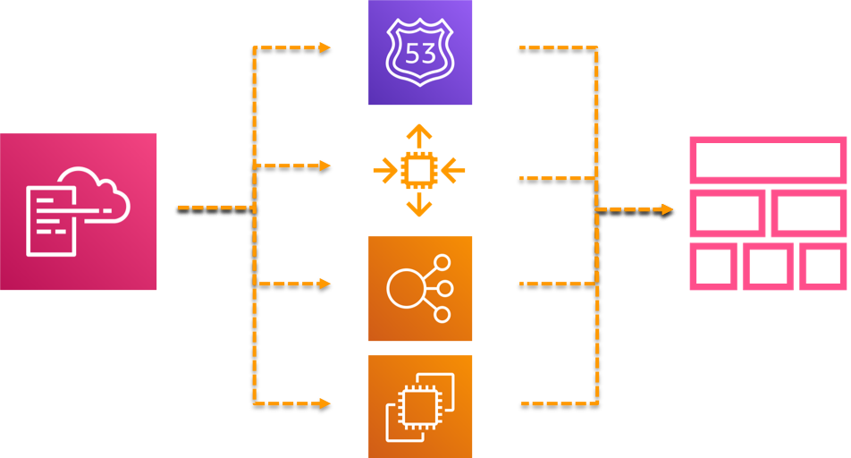

layout: true
name: section
class: title, no-footer, light
---
layout: true
name: footer

.footer[
- &copy; 2020, Amazon Web Services, Inc. or its Affiliates
- 
]

---
template: section
class: shelf
background-color: #232F3E
background-image: url(divider_slide_bg_orange.png)

# AWS CloudFormation Immersion Day
## Date

???
TALK TRACK NOTES:

AWS CloudFormation


---
class: compact
background-color: #232F3E

# Table of contents

- Introduction
- Coding Templates
- Template Language Functions
- Advanced Topics
- Table of contents

???
TALK TRACK NOTES:

---
template: section
class: shelf
background-color: #232F3E
background-image: url(divider_slide_bg_blue.png)

# Introduction 1

???
TALK TRACK NOTES:

AWS CloudFormation allows you to model your entire infrastructure in a text file. This template becomes the single source of truth for your infrastructure. This helps you to standardize infrastructure components used across your organization, enabling configuration compliance and faster troubleshooting. 

AWS CloudFormation provisions your resources in a safe, repeatable manner, allowing you to build and rebuild your infrastructure and applications, without having to perform manual actions or write custom scripts. CloudFormation takes care of determining the right operations to perform when managing your stack, and rolls back changes automatically if errors are detected. 

---
class: compact
background-color: #232F3E

# Introduction

Managing cloud applications involves managing the lifecycle of its resources:


???
TALK TRACK NOTES:

A cloud application typically consists of many components: networking (ie. traffic gateways), compute (Amazon EC2, containers), databases, streams, security groups, users, roles, etc.
All these servers and resources are the infrastructure components of your cloud application

---
class: compact
background-color: #232F3E

# Resources

Resources are the building blocks, or components of cloud applicationsSeveral ways of managing cloud resource lifecycle (creation, update, deletion)


???
TALK TRACK NOTES:

Typical ways of creating these components include: AWS Management Console (via web browser), command line interface (AWS CLI), programmatically (AWS SDK).
The console is probably the easiest, guided way to create a resource, but it is burdensome to create/change 100’s of resources
CLI and SDK may require advanced programming skills

---
class: compact
background-color: #232F3E

# AWS CloudFormation

At a high level, the template describes the intended state of your resources
CloudFormation then translates that intention to API calls, providing abstraction


???
TALK TRACK NOTES:

Essentially, CloudFormation is an API wrapper
As you know all AWS services are intractable via API. When you click create ec2 instance, and go through the wizard, in the end the Web Console triggers an API call to the EC2 service. And those information you placed through via the Wizard are all passed on as parameters.

Same with AWS CloudFormation. You can essentially find that all of the parameter names for CloudFormation resources are comparable to the API of the service. Because essentially CloudFormation are calling those APIs, what you define in CFN are being parsed as an API call to the service just like the wizard.

---
class: compact
background-color: #232F3E

# CloudFormation Artifacts


???
TALK TRACK NOTES:

These are the core artifacts that you will be acting on as you use CloudFormation.

---
class: img-right, fit-h1, compact
background-color: #232F3E

# Templates


A collection of resources
Over 500 types of resources
Resources are configured by properties
Allows for dependencies across resources
Can be written in YAML or JSON

---
class: compact
background-color: #232F3E

# Change Set

Enable you to preview how proposed changes to a stack might impact your running resources
CloudFormation makes the changes to your stack only when you decide to execute the change set 


???
TALK TRACK NOTES:

When you need to update a stack, understanding how your changes will affect running resources before you implement them can help you update stacks with confidence. Change sets allow you to preview how proposed changes to a stack might impact your running resources, for example, whether your changes will delete or replace any critical resources, AWS CloudFormation makes the changes to your stack only when you decide to execute the change set, allowing you to decide whether to proceed with your proposed changes or explore other changes by creating another change set. You can create and manage change sets using the AWS CloudFormation console, AWS CLI, or AWS CloudFormation API. 

https://docs.aws.amazon.com/AWSCloudFormation/latest/UserGuide/using-cfn-updating-stacks-changesets.html

---
class: img-right, fit-h1, compact
background-color: #232F3E

# Stack



A collection of resources managed as a single unit
Can be created, listed, described, updated, and deleted
Maintain the state of all the resources it contains


???
TALK TRACK NOTES:


---
class: img-right, fit-h1, compact
background-color: #232F3E

# Stack (2)


API calls are executed in parallel when possible, respecting dependencies
Resources are stabilized before other dependencies are executed
In case of a resource failure, the stack’s state will be rolled back to the last stable version

---
class: img-right, fit-h1, compact
background-color: #232F3E

# Stack (3)


When you need to make changes to a stack's settings or change its resources, you update the stack instead of deleting it and creating a new stack 

When you update a stack, you submit changes, such as new input parameter values or an updated template

Two methods for updating stacks: direct update or change sets (you create and execute)

???
TALK TRACK NOTES:

When you need to make changes to a stack's settings or change its resources, you update the stack instead of deleting it and creating a new stack. For example, if you have a stack with an EC2 instance, you can update the stack to change the instance's AMI ID. 
When you update a stack, you submit changes, such as new input parameter values or an updated template. AWS CloudFormation compares the changes you submit with the current state of your stack and updates only the changed resources.

When updating a stack, AWS CloudFormation might interrupt resources or replace updated resources, depending on which properties you update. 

https://docs.aws.amazon.com/AWSCloudFormation/latest/UserGuide/using-cfn-updating-stacks.html

---
class: compact
background-color: #232F3E

# Stack Set

Enables you to create, update, or delete stacks across multiple accounts and regions with a single operation
Stack Set


???
TALK TRACK NOTES:

Enterprise level…

When you create a stack set, you can create the stacks for that stack set. AWS CloudFormation also enables you to add more stacks, for additional accounts and regions, at any point after the stack set is created.

https://docs.aws.amazon.com/AWSCloudFormation/latest/UserGuide/stackinstances-create.html

---
template: section
class: shelf
background-color: #232F3E
background-image: url(divider_slide_bg_blue.png)

# Coding Templates

---
class: img-right, fit-h1, compact
background-color: #232F3E

# Template Syntax


- JSON – JavaScript object notation
- Attribute-value pairs

???
TALK TRACK NOTES:

You can author AWS CloudFormation templates in JSON or YAML formats. We support all AWS CloudFormation features and functions for both formats. 
AWS CloudFormation follows the ECMA-404 JSON standard. For more information about the JSON format, see http://www.json.org.

---
class: img-right, fit-h1, compact
background-color: #232F3E

# Template Syntax


- YAML – yet another markup language
- A human friendly data serialization standard
- Supports comments, avoids brackets and commas
- Can convert from one to the other (JSON, YAML) with cfn-flip
- YAML is a superset of JSON

???
TALK TRACK NOTES:

YAML inherently provides some features, such as commenting, that aren't available in JSON

CloudFormation doesn't support the following features:
The binary, omap, pairs, set, and timestamp tags
Aliases
Hash merges
https://learnxinyminutes.com/docs/yaml/

---
class: compact
background-color: #232F3E

# A Simple Template


???
TALK TRACK NOTES:

You declare parameters in a template's Parameters object. A parameter contains a list of attributes that define its value and constraints against its value. The only required attribute is Type, which can be String, Number, or an AWS-specific type. You can also add a Description attribute that tells a user more about what kind of value they should specify. The parameter's name and description appear in the Specify Parameters page when a user uses the template in the Create Stack wizard. 

---
class: compact
background-color: #232F3E

# A Simple Template


---
background-color: #232F3E

# A Simple Template


---
class: compact
background-color: #232F3E

# Writing Code


???
TALK TRACK NOTES:

---
class: compact
background-color: #232F3E

# Linting

- Supports multiple editors and IDEs (VisualStudio Code, Sublime, Atom, VIM, others), as well as CLI/headless operation for pipeline build steps
- Processes multiple files
- Leverages the resource specification, supporting all the latest resource types, and allows for specification overrides
- Custom rules allow for properties to be enforced: tags can be required, forbid properties and resources to be created, etc.
- Can run headlessly as a build step in a CI/CD pipeline


---
class: compact
background-color: #232F3E

# Create a stack using AWS CLI

```sh
aws cloudformation create-stack 
	--stack-name ec2InstanceCmdLineDemo 
	--template-url https://s3.amazonaws.com/cf-templates-deloitte-workshop/Demo-1.json
 	--parameters ParameterKey=KeyPair,ParameterValue=KeyName
```

???
TALK TRACK NOTES:

To create a stack you run the aws cloudformation create-stack command. You must provide the stack name, the location of a valid template, and any input parameters. 
Parameters are separated with a space and the key names are case sensitive. If you mistype a parameter key name when you run aws cloudformation create-stack, AWS CloudFormation doesn't create the stack and reports that the template doesn't contain that parameter. 

If you specify a local template file, AWS CloudFormation uploads it to an Amazon S3 bucket in your AWS account. AWS CloudFormation creates a unique bucket for each region in which you upload a template file. The buckets are accessible to anyone with Amazon S3 permissions in your AWS account. If an AWS CloudFormation-created bucket already exists, the template is added to that bucket. 
You can use your own bucket and manage its permissions by manually uploading templates to Amazon S3. Then whenever you create or update a stack, specify the Amazon S3 URL of a template file. 

---
class: col-2, fit-h1, compact
background-color: #232F3E

# Best Practices


???
TALK TRACK NOTES:

Smaller templates are easier to read, write, and faster to test and troubleshoot
A well crafted template can be used in different environments, like prod and test.  Using conditionals, the template can be reused
Complex applications should be separated into layers
Keep the lifecycle of the resources in mind.  For example, networking and security are likely not to change at the same time as the application binaries or databases will change.  Keep these in separate templates when possible, and any changes can be managed by limiting their blast radius

---
template: section
class: shelf
background-color: #232F3E
background-image: url(divider_slide_bg_blue.png)

# Template Language Functions

---
class: img-right, fit-h1, compact
background-color: #232F3E

# Template Anatomy


- Format version
- Transform 
- Description
- Metadata
- Parameters
- Mappings
- Conditions
- Resources* (required)    
- Outputs

???
TALK TRACK NOTES:

A template is a JSON- or YAML-formatted text file that describes your AWS infrastructure. 
The above example show an AWS CloudFormation template structure and all of its possible sections.
Format Version (optional)The AWS CloudFormation template version that the template conforms to. The template format version is not the same as the API or WSDL version. The template format version can change independently of the API and WSDL versions.
Description (optional)A text string that describes the template. This section must always follow the template format version section.
Metadata (optional)Objects that provide additional information about the template.
Parameters (optional)Values to pass to your template at runtime (when you create or update a stack). You can refer to parameters from the Resources and Outputs sections of the template.
Mappings (optional)A mapping of keys and associated values that you can use to specify conditional parameter values, similar to a lookup table. You can match a key to a corresponding value by using the Fn::FindInMap intrinsic function in the Resources and Outputssections.
Conditions (optional)Conditions that control whether certain resources are created or whether certain resource properties are assigned a value during stack creation or update. For example, you could conditionally create a resource that depends on whether the stack is for a production or test environment.
Transform (optional)For serverless applications (also referred to as Lambda-based applications), specifies the version of the AWS Serverless Application Model (AWS SAM) to use. When you specify a transform, you can use AWS SAM syntax to declare resources in your template. The model defines the syntax that you can use and how it is processed.
You can also use AWS::Include transforms to work with template snippets that are stored separately from the main AWS CloudFormation template. You can store your snippet files in an Amazon S3 bucket and then reuse the functions across multiple templates.
Resources (required)Specifies the stack resources and their properties, such as an Amazon Elastic Compute Cloud instance or an Amazon Simple Storage Service bucket. You can refer to resources in the Resources and Outputs sections of the template.
Outputs (optional)Describes the values that are returned whenever you view your stack's properties. For example, you can declare an output for an S3 bucket name and then call the aws cloudformation describe-stacks AWS CLI command to view the name.

---
class: img-right, fit-h1, compact
background-color: #232F3E

# Resources


- Only template section that is not optional
- Define resources to create/update
- Supports over 500 resource types
- Allows for custom resource types

???
TALK TRACK NOTES:

Templates include several major sections. The Resources section is the only required section. Some sections in a template can be in any order. However, as you build your template, it might be helpful to use the logical ordering of the following list, as values in one section might refer to values from a previous section
These days, it is recommended you create custom resource providers versus lambda-backed custom resources

---
class: compact
background-color: #232F3E

# Format Version and Description

**Format version **
- Currently only supports 1 value “2010-09-09”   

**Description**
- JSON/YAML string where you provide a Description (optional)
- Format Version and Description


???
TALK TRACK NOTES:

---
class: compact
background-color: #232F3E

# Metadata

Arbitrary JSON/YAML objects that provide additional details about the template  


???
TALK TRACK NOTES:

Metadata contains arbitrary JSON/YAML data. Objects that provide additional information about the template.

You can use cfn-get-metadata to call and pull the metadata from the stack for use on the instance.
The template designer and properties uses metadata to better render the template.

Another thing that Metadata is good for is to store insensitive configuration files or application description that you want to use for the instance.
This way you have a structured location where to put those messages.

Important
During a stack update, you cannot update the Metadata section by itself. You can update it only when you include changes that add, modify, or delete resources.

---
class: img-right, fit-h1, compact
background-color: #232F3E

# Parameters


- Enable you to input custom values to your template each time you create or update a stack (input validation and restriction)
- Supports parameter types: String, Number, List<Number>, CommaDelimitedList, AWS-Specific types and SSM types 
- Use the Ref intrinsic function to reference a parameter

???
TALK TRACK NOTES:

Use the optional Parameters section to customize your templates. Parameters enable you to input custom values to your template each time you create or update a stack. 

https://docs.aws.amazon.com/AWSCloudFormation/latest/UserGuide/parameters-section-structure.html

You must declare parameters as one of following types: String, Number, CommaDelimitedList, or an AWS-specific type (next slide)

Values to pass to your template at runtime (when you create or update a stack). You can refer to parameters from the Resources and Outputs sections of the template. 

---
class: img-right, fit-h1, compact
background-color: #232F3E

# AWS-specific Parameter Types


- Validates parameter values against existing values in users' AWS accounts
- Catches invalid values when you start creating or updating a stack
- Control UI using AWS::CloudFormation::Interface – metadata key that defines how parameters are grouped and sorted in the AWS CloudFormation console 
See AWS-Specific Parameter Types

???
TALK TRACK NOTES:

For AWS-specific parameter types, template users must specify existing AWS values that are in their account. AWS CloudFormation validates these parameter values against existing values in users' AWS accounts. AWS-specific parameter types are helpful in catching invalid values at the start of creating or updating a stack. 

https://docs.aws.amazon.com/AWSCloudFormation/latest/UserGuide/parameters-section-structure.html#aws-specific-parameter-types

---
class: compact
background-color: #232F3E

# AWS Systems Manager Parameter Types

Parameters that correspond to existing parameters in Systems Manager Parameter Store.  
AWS CloudFormation will fetch the latest value from Systems Manager Parameter Store
Note: To retrieve secure parameters, use dynamic references


???
TALK TRACK NOTES:

---
class: compact
background-color: #232F3E

# Dynamic References

Retrieves property values directly from AWS Systems Manager Parameter Store and AWS Secrets manager without having to declare a parameter


???
TALK TRACK NOTES:

---
class: compact
background-color: #232F3E

# Intrinsic Functions


You can only use intrinsic functions in specific template parts: resource properties, outputs, metadata attributes, and update policy attributes
You can also use intrinsic functions to conditionally create stack resources


???
TALK TRACK NOTES:

AWS CloudFormation provides several built-in functions that help you manage your stacks. Use intrinsic functions in your templates to assign values to properties that are not available until runtime. 
https://docs.aws.amazon.com/AWSCloudFormation/latest/UserGuide/intrinsic-function-reference.html

Pseudo parameters are parameters that are predefined by AWS CloudFormation. You do not declare them in your template. Use them the same way as you would a parameter, as the argument for the Ref function. 
https://docs.aws.amazon.com/AWSCloudFormation/latest/UserGuide/pseudo-parameter-reference.html

---
class: compact
background-color: #232F3E

# Fn::Ref

Fn::Ref returns the value of the specified parameter or resource
When you specify a parameter's logical name, it returns the value of the parameter
When you specify a resource's logical name, it returns a value that you can typically use to refer to that resource, such as a physical ID.


???
TALK TRACK NOTES:

Ref:

https://docs.aws.amazon.com/AWSCloudFormation/latest/UserGuide/intrinsic-function-reference-ref.html

---
class: compact
background-color: #232F3E

# Fn::GetAtt

Fn::GetAtt returns the value of an attribute from a resource in the template or in nested stack templates


???
TALK TRACK NOTES:

JSON:
{ "Fn::GetAtt" : [ "logicalNameOfResource", "attributeName" ] }

Syntax for the short form:
!GetAtt logicalNameOfResource.attributeName

Can be used in nested stack scenarios as above.  The example above is using short-form notation for YAML.
Using the nested stack reference to enforce the hierarchal path to an attribute and be many

DOC example (within same template)

AWSTemplateFormatVersion: 2010-09-09
Resources:
  myELB:
    Type: AWS::ElasticLoadBalancing::LoadBalancer
    Properties:
      AvailabilityZones:
        - eu-west-1a
      Listeners:
        - LoadBalancerPort: '80'
          InstancePort: '80'
          Protocol: HTTP
  myELBIngressGroup:
    Type: AWS::EC2::SecurityGroup
    Properties:
      GroupDescription: ELB ingress group
      SecurityGroupIngress:
        - IpProtocol: tcp
          FromPort: '80'
          ToPort: '80'
          SourceSecurityGroupOwnerId: !GetAtt myELB.SourceSecurityGroup.OwnerAlias
          SourceSecurityGroupName: !GetAtt myELB.SourceSecurityGroup.GroupName


---
class: compact
background-color: #232F3E

# Fn::Select

Fn::Select returns a single object from a list of objects by index


???
TALK TRACK NOTES:

Fn::Select does not check for null values or if the index is out of bounds of the array. Both conditions will result in a stack error, so you should be certain that the index you choose is valid, and that the list contains non-null values. 

You can use Fn::Select to select an object from a CommaDelimitedList parameter. You might use a CommaDelimitedList parameter to combine the values of related parameters, which reduces the total number of parameters in your template (max is 60)

https://docs.aws.amazon.com/AWSCloudFormation/latest/UserGuide/intrinsic-function-reference-select.html

Fn: join:

https://docs.aws.amazon.com/AWSCloudFormation/latest/UserGuide/intrinsic-function-reference-join.html

Ref:

https://docs.aws.amazon.com/AWSCloudFormation/latest/UserGuide/intrinsic-function-reference-ref.html

---
class: compact
background-color: #232F3E

# Fn::Join

Fn::Join appends a set of values into a single value, separated by the specified delimiter.  Similarly Fn::Sub can be used as well


???
TALK TRACK NOTES:

---
class: compact
background-color: #232F3E

# Fn::Sub

Fn::Sub substitutes variables in an input string with values that you specify.  
Use it to construct commands or outputs that include values that aren't available until you create or update a stack


???
TALK TRACK NOTES:

Fn::Sub https://docs.aws.amazon.com/AWSCloudFormation/latest/UserGuide/intrinsic-function-reference-sub.html

The intrinsic function Fn::Sub substitutes variables in an input string with values that you specify. In your templates, you can use this function to construct commands or outputs that include values that aren't available until you create or update a stack.

---
class: compact
background-color: #232F3E

# Fn::Base64

Fn::Base64 returns the Base64 representation of the input string. This function is typically used to pass encoded data to Amazon EC2 instances by way of the UserData property


???
TALK TRACK NOTES:

---
class: img-right, fit-h1, compact
background-color: #232F3E

# Fn::FindInMap


- The optional Mappings section matches a key to a corresponding set of named values. For example, if you want to set values based on a region, you can create a mapping that uses the region name as a key and contains the values you want to specify for each specific region. You use the Fn::FindInMap intrinsic function to retrieve values in a map
- Fn::FindInMap returns the value corresponding to keys in a two-level map that is declared in the Mappings section

  
???
TALK TRACK NOTES:

---
class: img-right, fit-h1, compact
background-color: #232F3E

# Conditionals


- Resource creation can depend on logical conditions. 
- You can use intrinsic functions, such as Fn::If, Fn::Equals, and Fn::Not, to conditionally create stack resources


---
class: compact
background-color: #232F3E

# Outputs

The optional Outputs section declares output values that you can import into other stacks (to create cross-stack references), return in response (to describe stack calls), or view on the AWS CloudFormation console


???
TALK TRACK NOTES:

---
template: section
class: shelf
background-color: #232F3E
background-image: url(divider_slide_bg_blue.png)

# Advanced Topics

---
class: compact
background-color: #232F3E

# Importing Resources

Add resources to stacks without recreating them


???
TALK TRACK NOTES:

---
class: compact
background-color: #232F3E

# Refactoring Stacks


???
TALK TRACK NOTES:

This is an unusual slide – can the deck text be separated from the image?

---
class: compact
background-color: #232F3E

# Drift Detection

Drift occurs if resource state is changed outside of CloudFormation
Can be detected for resources, stacks, and stack sets
Can be remediated by retaining, removing and reimporting the resource


---
class: compact
background-color: #232F3E

# Cross Stack References

You can use outputs from one stack in the nested stack group as inputs to another stack in the group. This differs from exporting values
Outputs values of the child stack can referenced by the parent stack or other nested stacks


???
TALK TRACK NOTES:

A declared export cannot be changed unless it is not being imported, so updating an export can be a pain.

---
class: img-right, fit-h1, compact
background-color: #232F3E

# Nested Stacks


- Common patterns can emerge in which you declare the same components in multiple templates
- Nested stacks create a stack hierarchy, where there’s a unique root or parent stack that declares child stacks
- A single operation on the parent stack will be effected to all child stacks
- Child stack templates must be placed in Amazon S3
- Outputs from a stack in the nested tree can be inputs to, or be referenced by, another stack in the tree

???
TALK TRACK NOTES:

Some nested stack challenges -
NOT to most agile:
High level of dependency
Works against segregation of roles & responsibilities in the enterprise
Great for publicly distributed quick starts…. But.
Broad Permissions often required:
	SecOps dislike *.*  ……
Blast Radius:
	One parent stack to destroy them all.
Testing can be challenging:
	Consider task cat tool

---
class: compact
background-color: #232F3E

# Nested Stacks

```yaml
AWSTemplateFormatVersion: '2010-09-09'
Resources:
  myStack:
    Type: AWS::CloudFormation::Stack
    Properties:
      TemplateURL: https://s3.amazonaws.com/cfn-templates-us-east-1/S3_Bucket.template
      TimeoutInMinutes: '60'
Outputs:
  StackRef:
    Value: !Ref myStack
  OutputFromNestedStack:
    Value: !GetAtt myStack.Outputs.BucketName
```

???
TALK TRACK NOTES:

When you declare a stack as a resource in a template, the result will be a nested stack

---
template: section
class: shelf
background-color: #232F3E
background-image: url(divider_slide_bg_blue.png)

# LAB
## AWS CloudFormation Immersion Day 2020


???
TALK TRACK NOTES:


